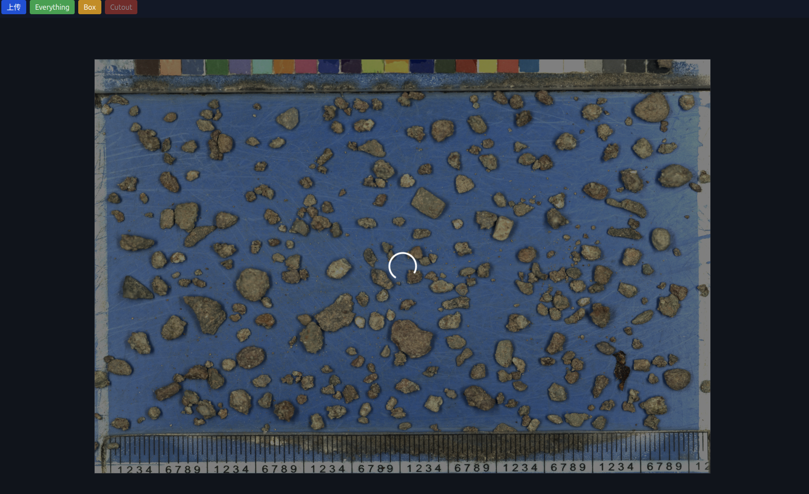

```markdown
# SegmentAnythingDemo

[](LICENSE)

一个基于 Meta AI [Segment Anything Model (SAM)](https://github.com/facebookresearch/segment-anything) 的全栈示例，演示如何用 **FastAPI** 构建后端推理 API，并用 **React + Vite + Tailwind CSS** 构建可交互的前端分割演示界面。

---

## 🔍 目录结构

```

SegmentAnythingDemo/
├── backend/               # 后端 FastAPI + SAM 推理代码
│   ├── requirements.txt   # Python 依赖列表
│   ├── **init**.py        # 将 backend 设为 Python 包
│   ├── main.py            # FastAPI 应用入口，定义 /segmentEverything、/segmentBox 路由
│   └── sam\_model.py       # SAM 模型加载、自动/框分割及后处理逻辑
└── frontend/              # 前端 React + Vite 项目
├── package.json       # 前端依赖与脚本
├── vite.config.js     # Vite 配置
├── tailwind.config.js # TailwindCSS 配置
├── postcss.config.js  # PostCSS 配置
├── index.html         # HTML 模板，挂载 React 应用
└── src/
├── index.css      # 全局样式
├── main.jsx       # React 入口脚本
└── components/
├── App.jsx    # 主应用组件，画布 & 分割逻辑
└── ToolBar.jsx # 工具栏组件：上传、Everything、Box、Cutout 按钮

````

---

## ✨ 主要功能

- **自动分割 (Everything)**  
  一键检测并分割图片中的所有目标，支持半透明填充、平滑轮廓、局部交互高亮、选中高亮发光。
- **框选分割 (Box)**  
  给定一个矩形框，快速生成单个目标的精确 mask。
- **SAM 后处理**  
  多尺度裁剪、局部极大值 + Watershed 细分、噪点去除、超大/边缘目标过滤、保持 mask 无重叠。
- **交互体验**  
  鼠标悬停高亮、点击选中发光、背景蒙暗、可配置进度动画。

---

## 🚀 快速开始

### 前置条件

- **Python 3.8+**  
- **Node.js 16+ & npm / yarn**  
- **CUDA + GPU**（可选，CPU 模式亦可）

### 后端部署

```bash
# 进入后端目录
cd SegmentAnythingDemo/backend

# 创建虚拟环境（推荐）
python -m venv .venv
source .venv/bin/activate

# 安装依赖
pip install -r requirements.txt

# 启动 Uvicorn 开发服务器
uvicorn main:app --host 0.0.0.0 --port 8001 --reload
````

> **注意**：请在 `sam_model.py` 中修改 `CKPT_H` 为你本地的 SAM checkpoint 路径。

### 前端启动

```bash
# 回到项目根目录，进入前端
cd SegmentAnythingDemo/frontend

# 安装依赖（首次）
npm install
# 或者
# yarn

# 启动开发服务器
npm run dev
# 或者
# yarn dev
```

浏览器访问：`http://localhost:5173`

---

## 🎬 效果预览



> Screencast: [2025-05-23 分割演示](assets/Screencast%20from%202025-05-23%2017-09-06.mp4)

---

## ⚙️ 参数配置

* **SAM 自动分割**
  在 `backend/sam_model.py` 中，`SamAutomaticMaskGenerator` 构造函数中的参数决定了分割密度、阈值、裁剪策略等。可根据场景（大目标、密集小目标、噪点多）自行调优：

  * `points_per_side` / `points_per_batch`
  * `pred_iou_thresh` / `stability_score_thresh`
  * `crop_n_layers` / `crop_overlap_ratio` / `crop_n_points_downscale_factor`
  * `min_mask_region_area`
* **后处理阈值**
  在 `_postprocess_masks` 中可调整：

  * 距离变换阈值（`0.2 * dist.max()`）
  * 最小区域面积（`< 30 px`）
  * 形态学核大小、迭代次数
* **前端动画 & 样式**
  在 `App.jsx` 中可更改加载遮罩、轮廓颜色/粗细、交互高亮样式。

---

## 🛠️ 开发 &调试

* **热重载**

  * 前端：`npm run dev` 已开启 HMR。
  * 后端：`uvicorn --reload` 自动重启。
* **日志打印**
  后端使用标准 `print` 和 FastAPI 错误处理，前端在控制台打印分割结果、错误信息，便于调试。

---

## 🤝 贡献

欢迎提 ISSUE 或 PR！

1. ⭐ Fork 本仓库
2. 📥 新建分支 (`git checkout -b feature/...`)
3. 🛠 实现 & 测试
4. 🔀 提交 PR，描述你的改动

---

## 📄 许可证

本项目采用 [MIT License](LICENSE)。
欢迎自由使用与修改，但请保留原作者声明。

---

```
```
